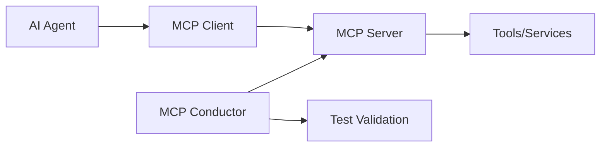

# AI Agent Testing with MCP Conductor

MCP Conductor is specifically designed for testing MCP servers that power AI agents and tools. This guide covers specialized patterns for AI agent testing scenarios.

## Table of Contents
- [AI Agent Architecture](#ai-agent-architecture)
- [Tool Testing Patterns](#tool-testing-patterns)
- [Agent Behavior Validation](#agent-behavior-validation)
- [Real-World Examples](#real-world-examples)
- [Performance Testing](#performance-testing)
- [Best Practices](#best-practices)

## AI Agent Architecture

### MCP in AI Agent Systems
Model Context Protocol (MCP) enables AI agents to securely access external tools and data sources. MCP Conductor helps ensure these integrations work correctly.



### Common AI Agent Tools
- **Data Retrieval**: Database queries, API calls, file system access
- **Content Generation**: Text processing, template rendering, document creation
- **External Services**: Email, notifications, third-party API integration
- **Analysis Tools**: Data processing, calculations, validations

## Tool Testing Patterns

### Tool Discovery and Schema Validation
Ensure agents can discover and understand available tools:

```yaml
description: "AI Agent Tool Discovery"
tests:
  - it: "should discover all agent tools"
    request:
      jsonrpc: "2.0"
      id: "discover"
      method: "tools/list"
      params: {}
    expect:
      response:
        jsonrpc: "2.0"
        id: "discover"
        result:
          tools:
            match:arrayElements:
              name: "match:type:string"
              description: "match:type:string"
              inputSchema:
                type: "object"
                properties: "match:type:object"
                required: "match:type:array"
    stderr: "toBeEmpty"

  - it: "should have well-documented tool descriptions"
    request:
      jsonrpc: "2.0"
      id: "descriptions"
      method: "tools/list"
      params: {}
    expect:
      response:
        result:
          tools:
            match:arrayElements:
              description: "match:regex:.{20,}"  # At least 20 chars
    stderr: "toBeEmpty"
```

### Programmatic Tool Schema Validation
```javascript
test('should validate tool schemas for agent compatibility', async () => {
  const tools = await client.listTools();
  
  tools.forEach(tool => {
    // Validate tool name follows conventions
    assert.match(tool.name, /^[a-z][a-z0-9_]*$/, 
      `Tool name "${tool.name}" should be snake_case`);
    
    // Validate description is comprehensive
    assert.ok(tool.description.length >= 20, 
      `Tool "${tool.name}" needs better description`);
    
    // Validate schema completeness
    assert.ok(tool.inputSchema.properties, 
      `Tool "${tool.name}" missing input properties`);
    
    // Check for required parameters documentation
    if (tool.inputSchema.required) {
      tool.inputSchema.required.forEach(param => {
        assert.ok(tool.inputSchema.properties[param], 
          `Required parameter "${param}" not documented`);
      });
    }
  });
});
```

### Context-Aware Tool Testing
Test tools with realistic AI agent context:

```yaml
- it: "should handle agent context in tool calls"
  request:
    jsonrpc: "2.0"
    id: "context"
    method: "tools/call"
    params:
      name: "search_documents"
      arguments:
        query: "quarterly financial report"
        context: "user requested financial analysis"
        max_results: 5
  expect:
    response:
      result:
        content:
          - type: "text"
            text: "match:contains:Found"
        metadata:
          query_processed: "match:type:string"
          context_used: true
  stderr: "toBeEmpty"
```

## Agent Behavior Validation

### Multi-Step Tool Sequences
Test complex agent workflows:

```javascript
test('should support multi-step agent workflows', async () => {
  // Step 1: Search for information
  const searchResult = await client.callTool('search_knowledge', {
    query: 'customer support best practices'
  });
  
  assert.equal(searchResult.isError, false);
  assert.ok(searchResult.content[0].text.includes('best practices'));
  
  // Step 2: Analyze the findings
  const analysisResult = await client.callTool('analyze_content', {
    content: searchResult.content[0].text,
    focus: 'actionable recommendations'
  });
  
  assert.equal(analysisResult.isError, false);
  assert.ok(analysisResult.content[0].text.includes('recommendations'));
  
  // Step 3: Generate summary
  const summaryResult = await client.callTool('generate_summary', {
    source_data: analysisResult.content[0].text,
    format: 'executive_summary'
  });
  
  assert.equal(summaryResult.isError, false);
  assert.ok(summaryResult.content[0].text.includes('Executive Summary'));
});
```

### State Management Testing
Validate stateful agent interactions:

```yaml
- it: "should maintain conversation context"
  request:
    jsonrpc: "2.0"
    id: "context-1"
    method: "tools/call"
    params:
      name: "conversation_manager"
      arguments:
        action: "initialize"
        user_id: "test_user_123"
  expect:
    response:
      result:
        content:
          - type: "text"
            text: "match:contains:session initialized"
        session_id: "match:type:string"
  stderr: "toBeEmpty"

- it: "should remember previous context"
  request:
    jsonrpc: "2.0"
    id: "context-2"
    method: "tools/call"
    params:
      name: "conversation_manager"
      arguments:
        action: "recall"
        user_id: "test_user_123"
        query: "what did we discuss?"
  expect:
    response:
      result:
        content:
          - type: "text"
            text: "match:contains:previous conversation"
  stderr: "toBeEmpty"
```

### Error Recovery Testing
Test agent resilience:

```javascript
test('should handle tool failures gracefully', async () => {
  // Test normal operation
  const normalResult = await client.callTool('external_api_call', {
    endpoint: 'users',
    action: 'list'
  });
  assert.equal(normalResult.isError, false);
  
  // Test failure scenario
  const failureResult = await client.callTool('external_api_call', {
    endpoint: 'invalid_endpoint',
    action: 'list'
  });
  
  // Should return error info, not throw
  assert.equal(failureResult.isError, true);
  assert.ok(failureResult.content[0].text.includes('endpoint not found'));
  
  // Test recovery - normal operation should work again
  const recoveryResult = await client.callTool('external_api_call', {
    endpoint: 'users',
    action: 'list'
  });
  assert.equal(recoveryResult.isError, false);
});
```

## Real-World Examples

### Component Library Integration
Testing component libraries for AI agents:

```yaml
description: "Component Library - AI Agent Integration"
tests:
  - it: "should provide component search for AI agents"
    request:
      jsonrpc: "2.0"
      id: "agent-search"
      method: "tools/call"
      params:
        name: "search_components"
        arguments:
          query: "form input components"
          context: "building user interface"
    expect:
      response:
        result:
          content:
            - type: "text"
              text: "match:contains:Input"
          metadata:
            total_results: "match:type:number"
            search_context: "match:contains:interface"
    stderr: "toBeEmpty"

  - it: "should provide component documentation"
    request:
      jsonrpc: "2.0"
      id: "agent-docs"
      method: "tools/call"
      params:
        name: "get_component_docs"
        arguments:
          component: "DataTable"
          format: "ai_friendly"
    expect:
      response:
        result:
          content:
            - type: "text"
              text: "match:contains:DataTable component"
          structured_data:
            props: "match:type:array"
            examples: "match:type:array"
            use_cases: "match:type:array"
    stderr: "toBeEmpty"
```

### Knowledge Base Integration
Testing knowledge base tools for AI agents:

```javascript
describe('Knowledge Base AI Integration', () => {
  test('should provide contextual search results', async () => {
    const result = await client.callTool('knowledge_search', {
      query: 'how to implement authentication',
      context: 'web application development',
      result_format: 'ai_structured'
    });
    
    assert.equal(result.isError, false);
    
    // Validate AI-friendly structure
    const content = result.content[0];
    assert.ok(content.text.includes('authentication'));
    
    // Check for structured data
    assert.ok(result.structured_data, 'Should include structured data');
    assert.ok(Array.isArray(result.structured_data.steps), 'Should include implementation steps');
    assert.ok(Array.isArray(result.structured_data.code_examples), 'Should include code examples');
  });

  test('should support follow-up queries', async () => {
    // Initial query
    const initial = await client.callTool('knowledge_search', {
      query: 'OAuth implementation',
      context: 'secure authentication'
    });
    
    // Follow-up query with context
    const followup = await client.callTool('knowledge_search', {
      query: 'security best practices',
      context: 'OAuth implementation',
      previous_query_id: initial.query_id
    });
    
    assert.equal(followup.isError, false);
    assert.ok(followup.content[0].text.includes('OAuth'));
    assert.ok(followup.content[0].text.includes('security'));
  });
});
```

## Performance Testing

### Response Time Testing
Ensure tools respond quickly for AI agents:

```javascript
test('should meet AI agent response time requirements', async () => {
  const startTime = Date.now();
  
  const result = await client.callTool('quick_lookup', {
    term: 'test query'
  });
  
  const duration = Date.now() - startTime;
  
  assert.ok(duration < 2000, 'Should respond within 2 seconds for AI agents');
  assert.equal(result.isError, false);
});

test('should handle concurrent agent requests', async () => {
  const promises = Array.from({ length: 10 }, (_, i) => 
    client.callTool('concurrent_operation', { id: i })
  );
  
  const startTime = Date.now();
  const results = await Promise.all(promises);
  const duration = Date.now() - startTime;
  
  // All requests should succeed
  results.forEach((result, i) => {
    assert.equal(result.isError, false, `Request ${i} should succeed`);
  });
  
  // Should complete within reasonable time
  assert.ok(duration < 10000, 'Concurrent requests should complete within 10 seconds');
});
```

### Memory and Resource Testing
```javascript
test('should manage resources efficiently for AI agents', async () => {
  const memBefore = process.memoryUsage();
  
  // Perform many operations
  for (let i = 0; i < 100; i++) {
    await client.callTool('memory_test_operation', { iteration: i });
    client.clearStderr(); // Clear buffers
  }
  
  const memAfter = process.memoryUsage();
  const heapGrowth = memAfter.heapUsed - memBefore.heapUsed;
  
  // Memory growth should be reasonable
  assert.ok(heapGrowth < 50 * 1024 * 1024, 'Memory growth should be under 50MB');
});
```

## Best Practices

### ✅ **Agent-Friendly Tool Design**

```yaml
# ✅ Good - Clear, specific tool names
tools:
  - name: "search_customer_data"
    description: "Search customer database with filters and pagination"
  - name: "generate_report"
    description: "Generate formatted reports from data sources"

# ❌ Bad - Vague, generic names  
tools:
  - name: "search"
    description: "Search stuff"
  - name: "process"
    description: "Process data"
```

### ✅ **Comprehensive Error Information**

```javascript
test('should provide detailed error information for agents', async () => {
  const result = await client.callTool('failing_operation', {
    invalid_param: 'bad_value'
  });
  
  if (result.isError) {
    // Validate error structure for AI agents
    assert.ok(result.error_code, 'Should provide error code');
    assert.ok(result.error_message, 'Should provide human-readable message');
    assert.ok(result.suggested_fix, 'Should provide suggested fix');
    assert.ok(result.documentation_link, 'Should provide documentation link');
  }
});
```

### ✅ **Structured Output for AI Processing**

```yaml
- it: "should provide structured data for AI processing"
  expect:
    response:
      result:
        content:
          - type: "text"
            text: "match:type:string"
        structured_data:
          entities: "match:type:array"      # Extracted entities
          sentiment: "match:type:string"    # Sentiment analysis
          categories: "match:type:array"    # Content categories
          confidence: "match:type:number"   # Confidence score
```

### ✅ **Context Preservation**

```javascript
test('should preserve context across tool calls', async () => {
  // Set initial context
  await client.callTool('set_context', {
    user_id: 'agent_test_user',
    session_id: 'test_session_123',
    preferences: { format: 'detailed', language: 'en' }
  });
  
  // Subsequent calls should use context
  const result = await client.callTool('get_recommendations', {
    category: 'products'
  });
  
  // Verify context was used
  assert.ok(result.context_applied, 'Context should be applied');
  assert.equal(result.user_preferences.format, 'detailed');
});
```

### ✅ **AI Agent Compatibility Testing**

```javascript
describe('AI Agent Compatibility', () => {
  test('should work with Claude/GPT agents', async () => {
    // Test with typical AI agent prompting patterns
    const result = await client.callTool('natural_language_processor', {
      instruction: 'Analyze this text and extract key insights',
      text: 'Sample business document content...',
      output_format: 'structured_json'
    });
    
    assert.equal(result.isError, false);
    
    // Validate AI-friendly output
    const insights = result.structured_output;
    assert.ok(insights.key_points, 'Should extract key points');
    assert.ok(insights.sentiment, 'Should include sentiment');
    assert.ok(insights.action_items, 'Should identify action items');
  });
  
  test('should handle conversational context', async () => {
    const result = await client.callTool('conversational_search', {
      query: 'find the report we discussed yesterday',
      conversation_context: 'Previous discussion about Q3 financial reports',
      user_context: { role: 'analyst', department: 'finance' }
    });
    
    assert.equal(result.isError, false);
    assert.ok(result.content[0].text.includes('Q3'));
  });
});
```

---

**Related Documentation:**
- [**Examples**]({{ '/examples.html' | relative_url }}) - More AI agent testing examples
- [**Programmatic Testing**]({{ '/programmatic-testing.html' | relative_url }}) - Advanced programmatic patterns
- [**Best Practices**]({{ '/examples.html#best-practices' | relative_url }}) - General testing best practices
